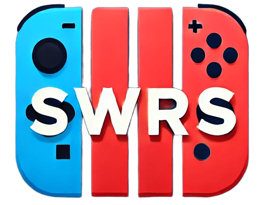

# SSBW-MUII2425
Repositorio de Sistemas Software Basados en Web en el Master Universitario en Ingeniería Informática 24/25

Autor: Sergio Hervás Cobo

## SWITCHERS

## 📋 Descripción del Proyecto
Aplicación web moderna para explorar videojuegos de Nintendo Switch con:
- ✅ Sistema de paginación avanzado
- ✅ Diseño responsive con Bulma CSS
- ✅ Gestión de errores
- ✅ Documentación API con Swagger
- ✅ Testing E2E con Playwright

## 🛠 Stack Tecnológico
| Tecnología       | Uso                                  |
|------------------|--------------------------------------|
| **Node.js**      | Entorno de ejecución backend        |
| **Express**      | Framework web                        |
| **Prisma**       | ORM para base de datos              |
| **Nunjucks**     | Motor de plantillas                 |
| **Bulma**        | Framework CSS moderno               |
| **Winston**      | Sistema de logging profesional      |
| **Playwright**   | Testing end-to-end y Web-Scrapping  |
| **Swagger**      | Documentación API                   |

## 🚀 Características Principales

### 🎮 Listado de Juegos con Paginación
- Sistema de paginación con navegación intuitiva
- Filtros por género, precio y rating (futuramente)
- Diseño de tarjetas responsive 

### 🛡 Página de Error
- Diseño amigable para usuarios
- Logging de errores en servidor (rotatorio)

### 📊 API Documentada
- Especificación OpenAPI 3.0
- Interfaz Swagger UI

### Usuarios de prueba:
- admin@example.com | admin
- user@example.com | string

**Repositorio**: https://github.com/SergioHrvas/SSBW-MUII2425